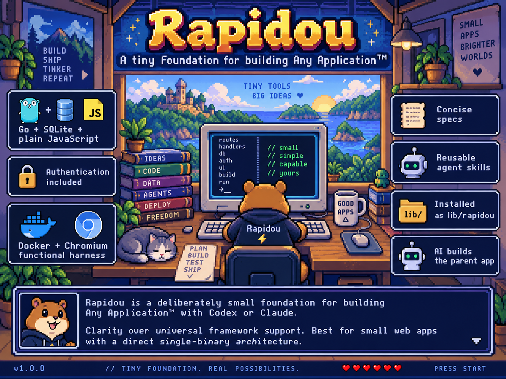

# Rapidou



Rapidou is a deliberately small foundation for building **Any Application™*** with Codex or Claude. It combines an opinionated Go/SQLite/plain-JavaScript base, authentication, a real Docker/Chromium functional harness, concise specifications, and reusable agent skills.

It is installed inside an application repository as `lib/rapidou`. The AI uses its example, rules, skills, and tests to implement the requested product in the parent repository.

> *Any small web application that benefits from a direct, single-binary architecture. Rapidou deliberately chooses clarity over universal framework support.

## Create an application

From the new application repository:

```sh
git submodule add <rapidou-repository-url> lib/rapidou
./lib/rapidou/run/install.sh
```

Restart Codex or Claude. In Codex, open `/hooks` once and trust the project hook. Then describe the application in normal language.

### Example prompt

This is only an example—the subject, features, and visual direction are yours:

```text
Use Rapidou's craft skill to build a community astronomy club website.

Visitors can browse upcoming observation nights and a photo gallery. Clicking
an event opens its full description, location, date, and registration link.

An administrator signs in to create, edit, and delete events, and can add
multiple images by upload or URL. Handle realistic empty and invalid inputs.

Use a modern editorial style: midnight blue, warm cream, large headings,
responsive cards, and simple dialogs. No animation is necessary.

Use lib/rapidou/src only as the base example. Write the spec first, implement
the complete application, test its API and real UI clicks in Docker, review it,
and run the final functional test again.
```

Rapidou does not blindly copy `src/`: the agent adapts the working example to the specification, writes the functional contract, implements the application, drives it through Chromium, reviews it independently, and runs the final test again.

After cloning an existing application:

```sh
git submodule update --init --recursive
./lib/rapidou/run/install.sh
./run/test.sh
```

See [installation](docs/installation.md) for existing hook configurations and repository setup.

## Explore Rapidou

The included [Museo Pixel example](docs/example.md) demonstrates authentication, persistence, image uploads, responsive dialogs, external store links, and complete API/browser journeys:

```sh
./run/dev.sh
./run/test.sh
```

## Documentation

- [Documentation router](docs/index.md)
- [Application principles](docs/shared/principles.md)
- [Project structure](docs/shared/structure.md)
- [Functional testing](docs/shared/testing.md)
- [Harness and agent workflow](docs/harness/index.md)
- [Current specifications](docs/specs/index.md)

Mandatory instructions for coding agents live in [`AGENTS.md`](AGENTS.md). Claude loads the same source through [`CLAUDE.md`](CLAUDE.md).
